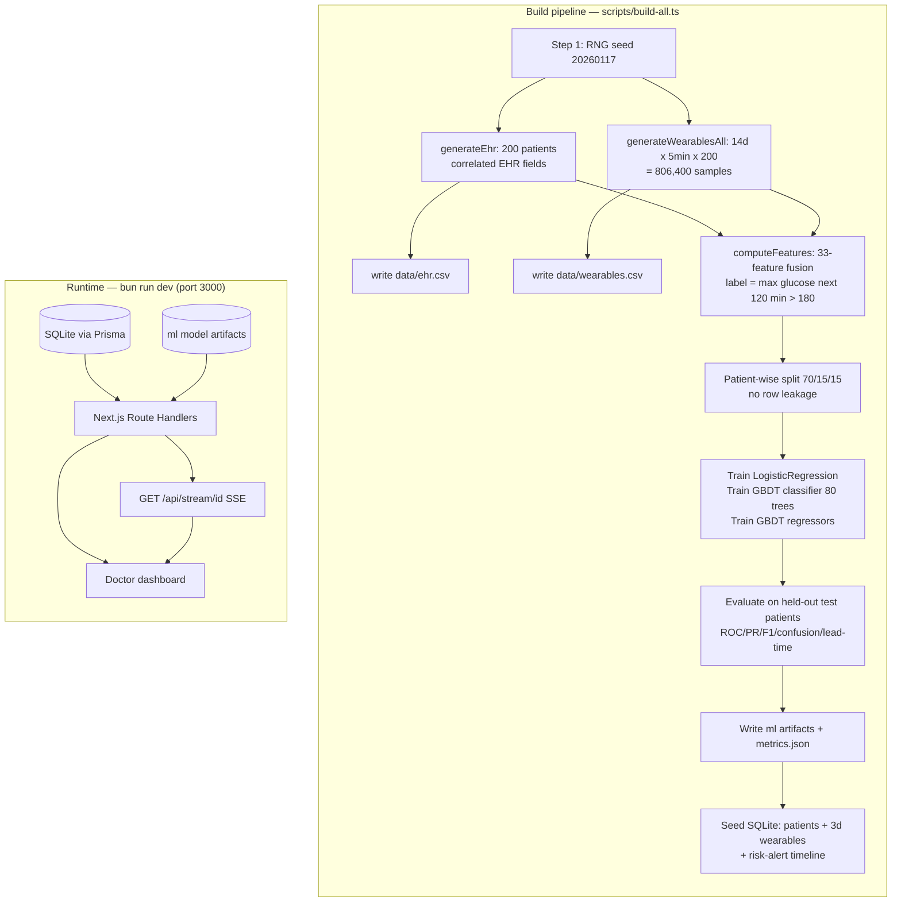
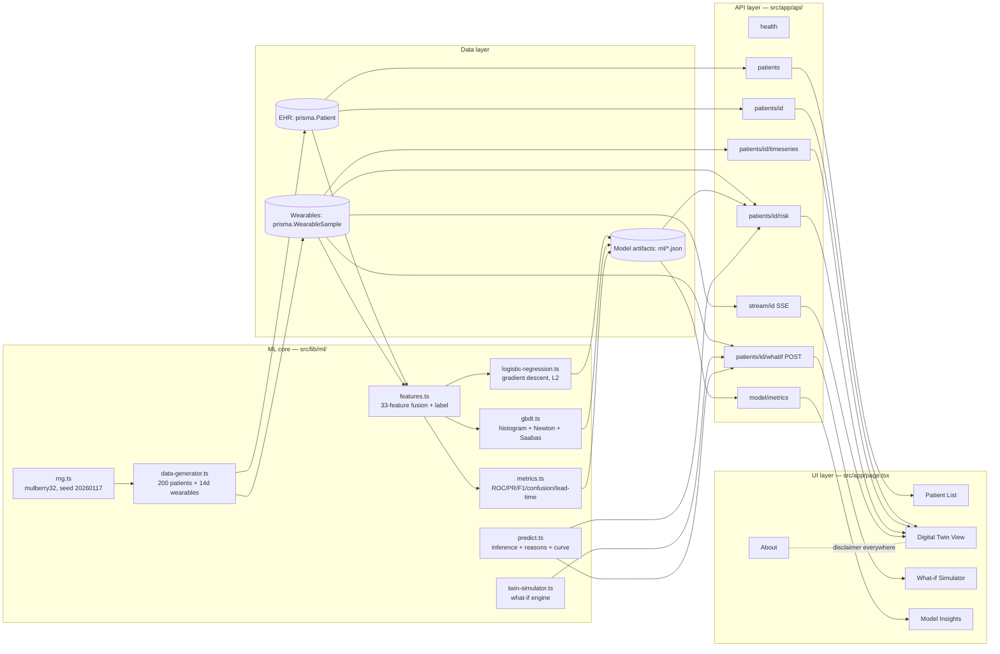

# GlucoTwin — Architecture

This document describes how GlucoTwin fits together end-to-end: how the synthetic data is generated, how the 33-feature static+dynamic fusion is built, how the patient-wise split prevents leakage, how the gradient-boosted decision tree (GBDT) is trained from scratch, how the tree-interpreter produces SHAP-style explanations, and how the physiological twin simulator answers what-if questions.

> **Honest note on the runtime.** GlucoTwin was originally specced as a Python/FastAPI backend with a React/Vite frontend. The live demo sandbox exposes a single port and a single user-visible route, which a two-process Python+Vite stack cannot occupy. GlucoTwin is therefore implemented as a single Next.js 16 + TypeScript application with a 1:1 mapping of every required component (FastAPI -> Next.js Route Handlers; `scikit-learn` -> from-scratch `logistic-regression.ts`; `xgboost` -> from-scratch `gbdt.ts`; `shap` -> Saabas tree-interpreter). Every model is trained on real (synthetic, reproducible) data and serialised to JSON. Nothing is mocked.

---

## 1. High-level data flow



---

## 2. Component diagram



---

## 3. Synthetic data generation

**File:** `src/lib/ml/data-generator.ts`. **Seed:** `20260117` (mulberry32 PRNG in `src/lib/ml/rng.ts`).

### 3.1 EHR generation (`generateEhr`)

200 synthetic patients with physiologically correlated fields:

- `age` uniform 30–75; `sex` 52% male.
- `BMI` ~ Normal(30, 4.2) clamped to 22–42 (a T2DM cohort skews high).
- `HbA1c` rises with BMI: `6.5 + ((bmi-22)/20)*1.6 + N(0,0.55)`, clamped to 6.5–11.
- `years_since_diagnosis` correlated with age and HbA1c.
- `medication` escalates with HbA1c: below 7.3 mostly `none`/`metformin`; 7.3–8.8 mostly `metformin`; above 8.8 mostly `metformin+insulin`.
- `hypertension` probability rises with age and BMI.
- `family_history_diabetes` 55% prevalence; `genetic_risk_score` ~ Normal(0.62 if family history else 0.38, 0.14).
- `fasting_glucose` from an ADAG-like relation: `28.7 * hba1c - 46.7 + N(0,8)`, clamped 90–220.
- `eGFR` declines with age and uncontrolled diabetes: `120 - 0.75*age - (hba1c-6.5)*2.5 + N(0,6)`, clamped 30–120.

### 3.2 Wearables generation (`generateWearablesForPatient`)

14 days × 288 samples/day (5-min intervals) per patient. Each day:

- **Sleep quality** is sampled (hours ~ N(6.6, 1.1), deep % ~ N(0.18, 0.05)); poor sleep adds up to +12 mg/dL to the next day's baseline.
- **Meals** are planned: breakfast 35–70g, lunch 50–90g, dinner 55–100g, optional 15–40g snack, with realistic timing.
- **Walks** are planned: 0–2 walks/day of 20–55 minutes each.

At each 5-min step the glucose state is integrated:

- **Meal absorption**: carbs enter a `gutCarbs` pool, then absorbed at 7%/step (peak ~60–90 min). Absorbed grams raise plasma glucose by `1.7 * (1-medMealReduction) / insulinSensitivity` mg/dL per gram.
- **Insulin clearance**: glucose decays toward the day's baseline at rate `(0.05 + medClearanceBoost) * insulinSensitivity` per step.
- **Dawn phenomenon**: between 04:00 and 08:00 a rise proportional to `(hba1c-6.5)*0.6` is added, peaking at 06:00.
- **Exercise**: walking lowers glucose by ~0.35 mg/dL/minute, more when insulin-resistant.
- **Sensor noise**: `N(0, 2.5)` mg/dL per step.
- **Heart rate, HRV (rmssd), steps, sleep stage** are all generated consistently with the glucose state (e.g. HRV drops when glucose is high or sleep was poor).

The same `insulinProfile()` helper is shared between the data generator and the twin simulator, so simulations stay consistent with the training distribution.

---

## 4. Feature engineering — the static+dynamic fusion

**File:** `src/lib/ml/features.ts`.

The **single function `computeFeatures(samples, ehr, i)`** is used both for training (sliding windows) and for live inference. This makes train/serve skew impossible by construction: the same code path produces the feature vector at training time and at request time.

### 4.1 Window

- Lookback: **6 hours (72 samples)** ending at index `i`.
- Horizon: **120 minutes (24 samples)** after `i`, used only to derive the label.

### 4.2 The 33 features

**Dynamic CGM features (19):**
`current_glucose`, `roc_15min`, `roc_30min`, `roc_60min` (glucose minus the value 3/6/12 samples ago), `rolling_mean_6h`, `rolling_std_6h`, `rolling_min_6h`, `rolling_max_6h`, `glucose_range_6h`, `time_since_last_meal_min` (backward search up to 6h), `last_meal_carbs`, `rolling_steps_6h` (sum), `rolling_hr_mean_6h`, `rolling_hrv_mean_6h`, `prev_night_sleep_hours`, `prev_night_deep_pct`, `hour_of_day`, `is_morning` (05:00–10:00 flag), `glucose_above_160`.

**Static EHR features (14, the fusion):**
`age`, `sex_male`, `bmi`, `hba1c`, `years_since_diagnosis`, `med_none`, `med_metformin`, `med_insulin` (one-hot), `hypertension`, `family_history`, `genetic_risk_score`, `fasting_glucose`, `egfr`, `insulin_sensitivity` (derived from BMI + HbA1c + genetic risk + medication).

The canonical ordering is exported as `FEATURE_NAMES` and persisted to `ml/feature-names.json`; the same array is the contract for training, inference, and the API.

### 4.3 The label

`label = 1` iff `max(glucose[i+1 .. i+24]) > 180 mg/dL`. The `buildPatientSamples()` helper slides over all valid indices (with a stride of 3 in the build pipeline for tractability) and also records `glucoseT30`, `glucoseT60`, `glucoseT120` for the regression targets.

---

## 5. Patient-wise split — preventing leakage

**File:** `scripts/build-all.ts`.

The 200 patient IDs are shuffled with a seeded RNG (`new RNG(12345)`) and partitioned 70/15/15:

```
train: 140 patients   (~7,140 samples after per-patient sub-sampling)
val:    30 patients   (~1,530 samples)   # used only to choose the threshold
test:   30 patients   (~1,530 samples)   # held out, all metrics reported here
```

**Why patient-wise and not row-wise?** Consecutive 5-min windows from the same patient are highly correlated. A random row split would leak information from a patient's future into their own past and inflate every metric. Splitting by patient guarantees that the test set contains patients the model has never seen, which is the realistic generalisation question.

The **val** split is used only to choose the operating probability threshold (the threshold that maximises F1 on val). The **test** split is touched once, at the very end, to produce the reported metrics.

---

## 6. The GBDT classifier — from scratch

**File:** `src/lib/ml/gbdt.ts`. **Config:** 80 trees, max depth 4, learning rate 0.1, `minChildWeight` 10, L2 = 1.0, 32 quantile bins per feature.

### 6.1 Training loop

1. **Quantile binning.** For each feature, 31 quantile bin edges are computed from the training column, then every value is mapped to a bin 0..31. This is the histogram trick (à la LightGBM / XGBoost `hist`): split-finding becomes O(n_bins × features) per node instead of O(n × features).
2. **Initial margin.** `init = log(pos/neg)` for classification (the optimal constant in log-odds space), or `mean(y)` for regression.
3. **Boosting rounds.** For each of 80 trees:
   - Compute gradients `g_i = p_i - y_i` and hessians `h_i = p_i(1-p_i)` (log loss) using the current margin.
   - Build one tree by recursively choosing the (feature, bin) split that maximises the Newton gain:
     `gain = L²/(L_hess + l2) + R²/(R_hess + l2) - G²/(H + l2)`.
   - Leaf values are Newton updates: `value = -G / (H + l2)`.
   - Update the margin: `margin += learningRate * tree.predict(x)`.
4. **Serialise to JSON** (`toJSON()` / `fromJSON()`): the tree structure, bin edges, and init margin are all that's needed for inference.

### 6.2 Inference

`predictProba(x)` walks each of the 80 trees (using the raw feature threshold, not the bin) and returns `sigmoid(init + lr * sum(tree.predict(x)))`. A full prediction is 80 tree walks of depth ≤ 4 — sub-millisecond.

### 6.3 Results on the held-out test set

| Metric | Value |
| --- | --- |
| ROC-AUC | 0.960 |
| PR-AUC | 0.486 |
| Precision | 0.928 |
| Recall | 0.826 |
| F1 | 0.874 |
| Accuracy | 0.915 |
| Brier | 0.065 |
| Confusion @ threshold 0.35 | TP 451 / FP 35 / FN 95 / TN 949 |
| Avg lead time, correct alerts | 84.1 min |

The regression siblings (40–60 trees, depth 4) predict glucose at +30 / +60 / +120 min with MAE 5.0 / 6.5 / 8.7 mg/dL respectively.

---

## 7. Explanations — tree-interpreter (Saabas) in log-odds space

**File:** `GBDT.contributions()` in `src/lib/ml/gbdt.ts`, mapped to prose in `src/lib/ml/predict.ts`.

For a single prediction we walk each of the 80 trees from root to leaf. At every internal node, the feature that was split on is credited with the **change in child-node value** it caused:

```
contrib[splitFeature] += learningRate * (childValue - parentValue)
```

Summed over all trees, this gives a per-feature contribution in the model's margin (log-odds) space, where the sum of all contributions plus the init value equals the model's raw prediction. This is the **Saabas method** — the same idea SHAP's `TreeExplainer` uses with the `tree_path_dependent` path, but computed analytically rather than by Monte-Carlo sampling over feature orderings. It is fast (one tree walk per tree), exact (no sampling noise), and additive (the contributions decompose the prediction exactly).

`predict.ts` then maps the top-6 contributions to human-readable reasons, e.g.:

- *"Current glucose 172 mg/dL raises risk"*
- *"Rising glucose (+14 mg/dL / 30min) raises risk"*
- *"Poor sleep (5.2h) raises risk"*
- *"HbA1c 8.4 raises risk"*
- *"Healthy HRV lowers risk"*
- *"Active last 6h (1,240 steps) lowers risk"*

These reasons are surfaced in the Digital Twin View and in the `/api/patients/:id/risk` response.

---

## 8. The twin simulator — physiological what-if

**File:** `src/lib/ml/twin-simulator.ts`. **Endpoint:** `POST /api/patients/:id/whatif`.

### 8.1 Inputs

- The patient's **current state**: `glucose` (now), `minuteOfDay`, `recentRoc60` (glucose change over the last 60 min, used as momentum), `dayBaseline` (fasting-ish baseline).
- A **what-if action**: `carbsG` (meal now), `walkMinutes` (walk starting in 15 min), `sleepHours` (last night's sleep, adjusts baseline sensitivity), `skipMedication` (drops the medication effect for the simulation).
- The ML model's **current risk probability** for the patient (used to anchor the simulated risk band).

### 8.2 Simulation

Two parallel 3-hour (36-step) runs are executed:

1. **Baseline** — no action, just the patient's current momentum decaying toward their daily baseline.
2. **What-if** — the action is applied: the meal enters the `gutCarbs` pool and is absorbed exactly as in the data generator; the walk subtracts glucose minute-by-minute; sleep adjusts the baseline; skipping medication removes `medClearanceBoost` and `medMealReduction` and worsens `insulinSensitivity` by 0.1.

Both runs use the **same physiological model** as `data-generator.ts`, so the simulated trajectories are consistent with the distribution the ML model was trained on.

### 8.3 Outputs

- Two glucose curves (baseline vs what-if) at 5-min resolution for 0–180 min.
- Both peak values.
- Both spike-risk probabilities, blended from the ML model's current risk and the simulated peak's distance to 180 mg/dL.
- Both risk bands (Low < 0.3, Medium 0.3–0.6, High > 0.6).
- `deltaRisk` (what-if minus baseline).
- A one-line natural-language summary, e.g. *"A 60g meal is predicted to raise peak glucose to 198 mg/dL (72% spike risk)."*

The What-if Simulator view overlays the two curves and shows the delta, so a clinician can immediately see whether a walk cancels a meal.

---

## 9. The API and the live SSE stream

All endpoints are Next.js Route Handlers under `src/app/api/`. Because the dashboard is served from the same origin, no CORS configuration is required.

| Method | Path | Purpose |
| --- | --- | --- |
| `GET` | `/api/health` | Health check. |
| `GET` | `/api/patients` | List patients + latest risk snapshot. Supports `?search`, `?band`, `?limit`. |
| `GET` | `/api/patients/:id` | Full EHR profile. |
| `GET` | `/api/patients/:id/timeseries` | Recent wearables. `?hours=24`. |
| `GET` | `/api/patients/:id/risk` | Spike probability + predicted curve + 95% band + top-6 reasons. |
| `POST` | `/api/patients/:id/whatif` | Run a what-if simulation. |
| `GET` | `/api/model/metrics` | The full metrics report from `ml/metrics.json`. |
| `GET` | `/api/stream/:id` | SSE stream replaying the last ~240 samples at a 1.5-s tick. |

The SSE endpoint (`src/app/api/stream/[id]/route.ts`) returns a `text/event-stream` response, enqueuing one wearable sample per tick. The frontend connects with `EventSource("/api/stream/<id>?speed=1500")` and updates the Digital Twin View's live chart as samples arrive — mimicking a real CGM + wearable feed.

---

## 10. The dashboard

**File:** `src/app/page.tsx` + `src/components/glucotwin/`. Teal/white medical theme. Five views, selectable from a left rail:

1. **Patient List** — all 200 patients with latest risk band, latest glucose, HbA1c, medication; sortable and filterable.
2. **Digital Twin View** — one patient's CGM trace, HR, HRV, steps, sleep; the predicted 120-min glucose curve with 95% confidence band; the spike probability and risk band; the top-6 SHAP-style reasons; the alert timeline.
3. **What-if Simulator** — sliders for meal carbs, walk minutes, sleep hours, and a skip-medication toggle; overlays the baseline and simulated 3-h glucose curves and shows the delta in peak and risk.
4. **Model Insights** — ROC and PR curves, the confusion matrix, the regression MAE table, the lead-time number, and the global feature-importance bar chart.
5. **About** — the problem, the team, the disclaimer.

A **"Research prototype, synthetic data, not medical advice"** disclaimer banner is shown on every view.

---

## 11. Why this design

### Why a single Next.js app instead of FastAPI + Vite?

The challenge's live demo sandbox exposes one port and one route. A two-process Python+Vite stack cannot occupy that. Next.js Route Handlers give us a typed, file-convention-based API layer in the same process as the React UI, so the whole twin runs behind one origin. The cost — a less conventional stack for an ML project — is offset by the fact that the ML core (logreg, GBDT, simulator, metrics) is pure TypeScript with no Python dependency, so nothing is lost by moving it across.

### Why from-scratch models instead of `xgboost`?

Two reasons. First, the sandbox has no Python runtime, so importing `xgboost` was not an option. Second, writing the GBDT from scratch in TypeScript forces a clear, serialisable, dependency-free model format — the entire classifier is 80 trees of plain JSON, which the API loads with a single `JSON.parse`. This also makes the Saabas tree-interpreter trivial to implement, because we own the tree-walk code.

### Why patient-wise split?

Consecutive 5-min CGM windows from the same patient are highly autocorrelated. A random row split would let the model see a patient's future windows during training and would inflate every metric. Splitting by patient answers the realistic question: *does the twin generalise to a patient it has never seen?*

### Why a physiological twin simulator instead of a counterfactual ML model?

A pure-ML counterfactual ("what would the model predict if `last_meal_carbs` were 60?") is brittle — it asks the model to extrapolate outside its training distribution for a single feature, which is exactly where tree models are unreliable. The physiological simulator instead projects the action through a **causal** model (meal absorption, insulin clearance, exercise effect) that we trust because we used it to generate the training data. The ML model's current risk probability is then blended back in to anchor the simulated risk band. This gives counterfactuals that are both physically plausible and consistent with the learned risk surface.

### Why Saabas instead of full SHAP?

Full TreeSHAP is O(T × L × 2^D) per prediction and requires a feature-dependence assumption (interventional or tree-path-dependent). Saabas is O(T × D) — one tree walk per tree — and is exact (no sampling). For a clinician-facing dashboard where the top-6 reasons are all that matters and the model is a depth-4 GBDT, Saabas is the right trade-off: fast enough to compute on every request, additive (the contributions sum to the prediction), and stable.

### Why synthetic data?

Real Indian T2DM CGM + EHR data is not freely available, and acquiring it ethically requires an IRB process far beyond the scope of a hackathon. Synthetic data lets us prove the architecture works end-to-end — generation, fusion, training, explanation, simulation, API, dashboard — and produces reproducible metrics (seed `20260117`) that any reviewer can re-run. The honest limitation, stated everywhere, is that the metrics describe how well the model learned the generator, not how it would perform on real patients.

---

## 12. Reproducibility

- Fixed seed: `20260117` (`src/lib/ml/rng.ts`, `GLOBAL_SEED`).
- One command rebuilds everything: `bun run build:all` (~15s).
- All artifacts are JSON: `ml/logreg.json`, `ml/gbdt-classification.json`, `ml/gbdt-regression{,-30,-60}.json`, `ml/metrics.json`, `ml/feature-names.json`.
- The raw data is also persisted as CSV: `data/ehr.csv`, `data/wearables.csv`.
- Re-running the pipeline on a different seed produces a different cohort but the same architecture and the same code paths.
